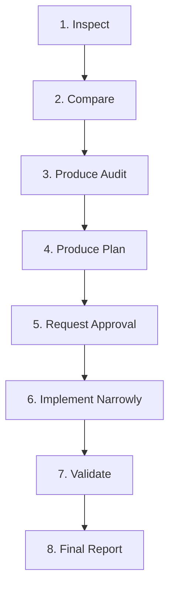

# DXBMARK Design & Implementation Constitution v2.2

## Document Control Block
- **Title**: DXBMARK Design & Implementation Constitution
- **Version**: `v2.2`
- **Status**: `Binding operational standard`
- **Scope**: `DXBMARK public website`
- **Canonical Path**: `docs/DXBMARK_DESIGN_IMPLEMENTATION_CONSTITUTION.md`
- **Visual Benchmark**: Approved Homepage Hero (`src/components/home/hero/HeroSection.tsx`)
- **Token Benchmark**: `src/app/globals.css` and `Docs/DESIGN.md`
- **Last Updated**: 2026-06-21
- **Maintainer**: DXBMARK LLC

---

## 0. Document Authority

### 0.1 Binding Status
This document constitutes the supreme governing law for the design, development, content management, and deployment of all pages, features, and assets on the DXBMARK LLC official website. It is binding for all developers, designers, and AI coding agents.

### 0.2 Mandatory Review Rule
- **MUST READ**: This file **MUST** be read in its entirety before any design, modification, or implementation task is initiated.
- **NO DEVIATION**: No page, section, component, animation, form, or content block **MAY** violate this constitution without explicit, documented user approval.
- **CONFLICTS**: If any requested change conflicts with the directives in this document, the developer/agent **MUST** immediately stop work and report the conflict.

### 0.3 Visual Benchmark
The Homepage Hero Section (`src/components/home/hero/HeroSection.tsx`) and the Design Tokens defined in `src/app/globals.css` are the absolute benchmarks for visual layout, styling, and motion execution.

### 0.4 Risk Mitigation Matrix
To ensure this document is enforceable and prevents regression, the following risk mitigations are established:
- **Risk**: Creating generic rules that are not enforceable.  
  *Mitigation*: Every rule uses explicit technical criteria, target CSS classes, and exact Next.js repository-relative file paths.
- **Risk**: Writing rules that conflict with the current codebase.  
  *Mitigation*: All token classes, variables, and animations listed herein have been verified against `src/app/globals.css` and the active code tree.
- **Risk**: Missing actual Hero design references.  
  *Mitigation*: Exact styling, margins, stagger settings, and class selectors are directly extracted from `src/components/home/hero/HeroSection.tsx` and its children.
- **Risk**: Failing to include implementation templates.  
  *Mitigation*: Section 22 provides drop-in Markdown templates for Audits, Plans, and Reports.
- **Risk**: Failing to include validation gates.  
  *Mitigation*: Section 21 details exact CLI verification commands that must run to zero errors.
- **Risk**: Creating a document too short to prevent inconsistencies.  
  *Mitigation*: This document covers all design categories including Typography, Backgrounds, Badges, Buttons, Cards, Forms, Copy, Animations, and Dependencies with strict "MUST/MUST NOT" rules.

---

## 1. Operating Model

Any engineering or design task **MUST** proceed through the following 8-stage lifecycle. No stage may be skipped.



1. **Inspect**: Read target codebase files and search for relevant styles, layouts, or assets.
2. **Compare**: Measure requirements against the rules of this Constitution.
3. **Produce Audit**: Document deviations, missing components, or anti-patterns in the existing code.
4. **Produce Plan**: Outline precise changes, allowed files, forbidden files, risks, and verification commands.
5. **Request Approval**: Present the plan to the user. **NO** implementation may begin without explicit approval.
6. **Implement Narrowly**: Modify only the approved files.
7. **Validate**: Execute the verification test commands to verify compilation, types, and visual behavior.
8. **Final Report**: Document exactly what was changed, including screenshots or validation output.

---

## 2. SpecKit-Style Lifecycle

### 2.1 Audit Mode
- **WHEN REQUIRED**: Must be activated prior to making changes to existing UI layouts, fixing visual bugs, or reviewing third-party design components.
- **MUST**: Output a complete comparison matrix identifying differences in typography, spacing, styling, and structural components.
- **MUST NOT**: Modify, create, delete, stash, or stage any codebase file during this mode.

### 2.2 Plan Mode
- **WHEN REQUIRED**: Required for all features, component additions, and structural styling updates.
- **MUST**: Clearly designate an "Allowed Files" list and a "Forbidden Files" list.
- **MUST**: Propose exact, line-by-line implementation logical steps.
- **MUST**: Present the plan to the user and wait for approval.

### 2.3 Implementation Mode
- **WHEN REQUIRED**: Active only after user approval is obtained.
- **MUST**: Target only files defined in the approved "Allowed Files" list.
- **MUST NOT**: Perform broad refactors of unrelated files. Unrelated visual "cleanups" are strictly forbidden.

### 2.4 Constitution Compliance Mode
- **WHEN REQUIRED**: Active at the end of implementation, before marking a task complete.
- **MUST**: Validate the output against the visual checks of Sections 4 through 19.
- **MUST**: Report any deviations as blockers to be fixed immediately.

---

## 3. DXBMARK Brand Positioning

### 3.1 Business Identity
DXBMARK LLC is a professional technology services company providing high-performance engineering, systems architecture, and managed hosting solutions.
- **WE ARE**: Software engineering, SaaS platforms, automation workflows, integrations, cloud infrastructure, managed hosting, DevOps, web systems, and technical consulting.
- **WE ARE NOT**: A generic creative agency, a branding studio, a template SaaS startup, a marketing/advertising agency.

### 3.2 Copywriting and Brand Voice
- **MUST**: Be direct, technical, commercially minded, concise, and focused on system reliability, outcomes, and business scale.
- **MUST NOT**: Use generic placeholder text ("lorem ipsum"), empty hype words ("synergistic solutions", "disruptive ecosystems"), or fake data.
- **TONE**: Professional, clean, and engineering-driven.

---

## 4. Approved Visual Benchmark (Hero Section Rules)

The following parameters must be strictly replicated for all main visual layouts:

| Design Element | Technical Rule / Class | Source File | Rationale |
| :--- | :--- | :--- | :--- |
| **Background Shell** | Slate Blue `#0f172a` (`bg-background-slate` / `body`) | `src/app/globals.css` | Unifies dark-first layout atmosphere. |
| **Atmospheric Glow** | Radial Blue Gradient overlay: `bg-brand-glow` with `blur-[120px]`, `pointer-events-none` | `src/components/visual/index.tsx` | Component `Glow` provides depth without blocking clicks. |
| **Heading Font Scale** | `font-sans text-3xl sm:text-4xl md:text-5xl lg:text-[4.25rem] font-black tracking-tight leading-[1.05]` | `src/components/home/hero/HeroSection.tsx` | Asserts brand confidence through bold typography. |
| **Heading Gradient** | Text clips using gradient `from-text-main via-brand-primary to-brand-secondary bg-clip-text text-transparent` | `src/components/home/hero/HeroSection.tsx` | Distinctive orange-brand highlight on core action phrase. |
| **Subtitle Typography** | `font-body text-xs sm:text-sm md:text-base lg:text-lg text-text-sub leading-relaxed max-w-2xl` | `src/components/home/hero/HeroSection.tsx` | Ensures readability of supporting copy. |
| **Scroll Indicator** | `.hero-scroll-cue` featuring vertical layout, bouncing accent dot, group-hover effects | `src/components/home/hero/HeroScrollCue.tsx` | Micro-animation guiding scroll discovery. |
| **Trust Logo Strip** | `.animate-dxb-marquee` infinite animation with mask-image feather fade gradients | `src/components/home/hero/HeroTrustLogos.tsx` | Promotes credibility using dynamic marquee motion. |

---

## 5. Design Token System

### 5.1 Token Enforcement
- **MUST**: Map all colors, padding sizes, font families, and border radii to variables defined in `src/app/globals.css`.
- **MUST NOT**: Introduce raw HEX values inside React components or Tailwind classes when a token exists.
- **MUST NOT**: Use generic Tailwind default palettes (such as `zinc`, `rose`, or `neutral`) unless mapped under a semantic design token variable in `globals.css`.

### 5.2 CSS Variable References
- **Accent Primary**: `var(--color-accent-primary)` / `var(--color-brand-primary)` (`#f97e1a`)
- **Accent Secondary**: `var(--color-accent-secondary)` / `var(--color-brand-secondary)` (`#e89548`)
- **Background Main**: `var(--color-bg-primary)` / `var(--color-background-slate)` (`#0f172a`)
- **Text Main**: `var(--color-text-primary)` / `var(--color-text-main)` (`#ffffff`)
- **Text Secondary**: `var(--color-text-secondary)` / `var(--color-text-sub)` (`#dedede`)
- **Soft Border**: `var(--color-border-soft)` / `var(--color-border-soft-val)` (`rgba(255,255,255,0.08)`)

---

## 6. Raw Hex and Token Governance

### 6.1 Color Policy
1. New raw HEX values inside React components are forbidden when an existing CSS token can be used.
2. Existing approved raw HEX values are not automatically forbidden if they are part of an approved legacy design implementation (e.g., specific SVG paths).
3. Any repeated raw HEX value must be promoted to a CSS variable or Tailwind token in `src/app/globals.css`.
4. Raw HEX can remain only when:
   - It is documented in the Exceptions Register, or
   - It is part of an approved legacy component (e.g., SVG path elements), or
   - Converting it immediately would create visual risks and a migration target is recorded.

### 6.2 Token Value Categorization
- **Approved Tokenized**: Use `bg-brand-primary`, `text-text-sub`, `border-border-soft-val`, `var(--color-accent-primary)`.
- **Approved Legacy Exception**: `#0d2130` (inner badge), `#0a101d` (footer background).
- **Must Migrate**: Hardcoded `#f97e1a` in page layouts where `bg-brand-primary` or `text-brand-primary` is available.
- **Forbidden New Usage**: Adding new inline styles with raw colors or using unapproved palettes (such as `rose`, `zinc`, or `cyan`).

---

## 7. Raw Hex Audit and Token Migration Protocol

### 7.1 Search Commands
Before implementing any UI task, run a search for raw color usage in the affected directory:
```bash
# Standard Grep
grep -RInE "#[0-9a-fA-F]{3,8}|rose-|zinc-|cyan-|green-|neutral-" src/ --exclude-dir=node_modules --exclude-dir=.next

# Ripgrep
rg "#[0-9a-fA-F]{3,8}|rose-|zinc-|cyan-|green-|neutral-" src/
```

### 7.2 Protocol Steps
1. Execute the search on the files in scope.
2. If raw hex is present, cross-reference it with the `Exceptions Register`.
3. If it is an unapproved raw value, map it to the corresponding token from `src/app/globals.css`.
4. If a token is missing, document it in the `Token Migration Register` and request approval to add the token.

---

## 8. Token Migration Register

The following raw colors must be migrated to tokens during future cleanup phases:

| Value | Current Location | Current Usage | Proposed Token Name | Migration Risk | Migration Priority | Status |
| :--- | :--- | :--- | :--- | :--- | :--- | :--- |
| `#f97e1a` | `src/components/contact/ContactSection.tsx` | Hardcoded borders and text | `var(--color-brand-primary)` | Low (pure token mapping) | P1 | Migration planned |
| `#ff8a2a` | `src/components/contact/ContactSection.tsx` | CTA hover state bypass | `var(--color-brand-hover)` | Low (pure token mapping) | P1 | Migration planned |
| `neutral-400` | `src/components/ui/separator-pro.tsx` | Template color leakage | `var(--color-text-muted)` | Low (border theme sync) | P2 | Migration planned |

---

## 9. Exceptions Register

The following visual exceptions are approved for use in the codebase:

| Exception ID | Exception | Current Location | Reason | Replacement Target | Status | Approval Source | Review Trigger |
| :--- | :--- | :--- | :--- | :--- | :--- | :--- | :--- |
| `DXB-EXC-20260620-001` | Raw bg color `#0f172a` | `src/app/page.tsx` | Shell background styling | `var(--color-bg-primary)` | Active | Product Lead | Next Page Redesign |
| `DXB-EXC-20260620-002` | Dark background `#0a101d` | `src/components/layout/footer.tsx` | Legacy footer background | None (permanent design) | Active | Product Lead | None |
| `DXB-EXC-20260620-003` | Inner badge background `#0d2130` | `src/components/home/hero/HeroBadge.tsx` | Specialized glass background | None (performance optimized) | Active | Product Lead | Component Unified |
| `DXB-EXC-20260620-004` | External TopoJSON CDN | `src/components/ui/globe-wireframe.tsx` | Geography data asset | Local host file asset | Active | Tech Lead | Offline Capability Check |
| `DXB-EXC-20260620-005` | Curve SVG GSAP interpolation | `src/components/layout/footer.tsx` | Footer jelly SVG path morphing | CSS scroll animation | Active | Tech Lead | Performance review |

---

## 10. Design Decision Log

Track all architectural, token, and component override decisions here.

```markdown id="z4m3yp"
## Decision Log Entry

- Date:
- Decision ID:
- Decision:
- Context:
- Files affected:
- Alternatives considered:
- Reason for decision:
- Risks:
- Approval source:
- Follow-up action:
- Review trigger:
```

### Registered Log Entries

#### DXB-DESIGN-20260620-001
- **Date**: 2026-06-20
- **Decision ID**: `DXB-DESIGN-20260620-001`
- **Decision**: Adopt D3 + TopoJSON for the Globe component instead of importing a heavy three.js canvas renderer.
- **Context**: Contact page required an interactive, touchable wireframe globe.
- **Files affected**: `src/components/ui/globe-wireframe.tsx`, `src/components/contact/ContactSection.tsx`
- **Alternatives considered**: Three.js standard canvas globe.
- **Reason for decision**: Matches the wireframe style of the design and ensures fast page load time.
- **Risks**: CDN fetch dependency.
- **Approval source**: User instruction.
- **Follow-up action**: Ensure fallback does not crash the page.
- **Review trigger**: Performance review.

#### DXB-DESIGN-20260620-002
- **Date**: 2026-06-20
- **Decision ID**: `DXB-DESIGN-20260620-002`
- **Decision**: Define the official page-level background system consisting of `bg-background-slate` (#0f172a) combined with the shared blue `<Glow />` component at the root.
- **Context**: Contact page background did not match the Homepage, resulting in a dark/flat appearance.
- **Files affected**: `docs/DXBMARK_DESIGN_IMPLEMENTATION_CONSTITUTION.md`, `src/components/contact/ContactSection.tsx`, `src/app/page.tsx`
- **Alternatives considered**: Separate custom orange glow layers or solid `#0f172a` only.
- **Reason for decision**: Ensures absolute brand styling consistency and matching royal blue visual layouts across all present and future pages.
- **Risks**: None.
- **Approval source**: User instruction.
- **Follow-up action**: Standardize all new routes using this layout structure.
- **Review trigger**: Layout design audits.

---

## 11. Severity and Stop-Work Gates

Tasks MUST be governed by the following Severity Gates. Any violation of a BLOCKER or HIGH gate stops implementation or completion immediately.

### 11.1 BLOCKER (Immediate Stop-Work)
- **Definition**: Critical violations that prevent the page from being deployment-ready.
- **Action**: Stop implementation, revert changes, and report the block to the user.
- **Examples**:
  - Customer-facing page displays internal developer notes (e.g. MySQL, Zoho Integration, API routing).
  - Fake contact details, addresses, testimonials, or metrics are present.
  - The build, typecheck, or lint command fails, and the agent claims success.
  - Form fields lack accessible `<label>` bindings or descriptive `aria-label` attributes.
  - Code changes are made outside the approved allowed scope (e.g., modifying `header.tsx` or `footer.tsx` out of task context).
  - New dependency added to `package.json` without review and approval.
  - Raw HEX values added as new styling when a matching token exists.
  - Hero benchmark source reference is invented.

### 11.2 HIGH (Requires Plan Approval)
- **Definition**: Visual or behavioral deviations that affect brand alignment.
- **Action**: Formulate a fix plan and seek approval before completing the task.
- **Examples**:
  - One-off component styling created where a shared UI primitive exists.
  - Motion sequences lacking media queries for `(prefers-reduced-motion: reduce)`.
  - CTA button hidden below the first fold on standard viewports without visual justification.
  - External CDN resources used without local fallback structures.

### 11.3 MEDIUM (Log and Group)
- **Definition**: Minor layout inconsistencies.
- **Action**: Add to the planned post-implementation cleanup log.
- **Examples**:
  - Minor spacing or margin mismatches.
  - Glow overlays slightly misaligned.
  - Copy is clean and real but could be optimized for conversion.

### 11.4 LOW (Log Only)
- **Definition**: Micro-level visual refinements.
- **Action**: Log as general feedback.

---

## 12. Typography Constitution

### 12.1 Font Families
- **Headlines & Headers**: `var(--font-sans)` (Inter)
- **Body / Prose**: `var(--font-body)` (Manrope)
- **Buttons / Badges / Navigation**: `var(--font-label)` (Plus Jakarta Sans)
- **Code / Metrics / Monospace**: `var(--font-code)` (JetBrains Mono)

### 12.2 Hierarchy Rules
- **H1 (Primary Headings)**: `font-sans text-3xl sm:text-4xl md:text-5xl lg:text-[4.25rem] font-black tracking-tight leading-[1.05]`.
- **H2 (Secondary Headings)**: `font-sans text-2xl sm:text-3xl md:text-4xl font-bold tracking-tight leading-snug`.
- **H3 (Section Headers)**: `font-sans text-xl sm:text-2xl font-bold text-white`.
- **Body Text**: `font-body text-sm sm:text-base text-text-sub leading-relaxed max-w-2xl`.

---

## 13. Page Layout Constitution

### 13.1 Layout Rules
- **First Fold Layout**: The above-the-fold interface **MUST** fit elegantly without forcing vertical scrolling on standard laptop displays (1366x768 / 1440x900) unless intended.
- **Max Width Bounds**: All page content blocks **MUST** be bounded by a layout container limiting width:
  - Wrapper: `max-w-7xl mx-auto px-4 sm:px-6 lg:px-8` (matching `src/components/ui/layout.tsx` `Container`)
  - Max content width: `max-w-6xl`
- **Responsive Overflow**: No component or layout block **MUST** trigger horizontal scrollbars under any screen size down to 320px width (`overflow-x-hidden` on main layout nodes).

---

## 14. Background and Glow Rules

### 14.1 Aurora Atmospheric Glows
- **Aria Hidden**: All glowing background overlays **MUST** be configured with `aria-hidden="true"`.
- **Pointer Events**: Background glow layers **MUST** use `pointer-events-none` to prevent blocking mouse interactions on interactive elements.
- **Opacity Cap**: Glow layers **SHOULD NOT** exceed `opacity-20` on standard dark backgrounds.

### 14.2 Footer Jelly Divider Glow
- The giant brand text (`.footer-brand-word`) and radial glow layers (`.footer-glow-layer`) **MUST** maintain their respective stroke configurations and animations as modified by design constraints.

### 14.3 Official Page Background System
- **Mother Background Token**: All current and new website pages **MUST** use the official design token class `bg-background-slate` (which resolves to `#0f172a` in `src/app/globals.css`) on the root element.
- **Page Glow Overlay**: Every page/section wrapper **MUST** contain the shared blue `<Glow className="absolute inset-0 z-0" />` component rendered as the first child of the root container. This creates the official, consistent royal blue radial gradient.
- **Prohibition of Custom Background Glows**: Pages **MUST NOT** define custom local colored background gradient overlays or custom glow layers (e.g., orange or red glows covering the page background) to prevent layout-level color discrepancies. All layouts must preserve the clean, official blue atmosphere.

---

## 15. Badge Constitution

### 15.1 Double Border Gradient Spinner
- **MUST**: Reuse the custom animated badge system matching `src/components/home/hero/HeroBadge.tsx` for brand consistency.
- **Structure**:
  ```tsx
  <div className="relative z-0 bg-white/5 overflow-hidden p-px flex items-center justify-center rounded-full">
    <div 
      className="absolute -left-1/2 -top-1/2 w-[200%] h-[200%] bg-no-repeat bg-[100%_50%] bg-[length:50%_30%] blur-[4px] animate-[spin_6s_linear_infinite]"
      style={{ backgroundImage: "linear-gradient(to right, var(--color-accent-primary), var(--color-accent-secondary))" }}
    />
    <div className="relative flex items-center gap-2.5 px-3.5 py-1.5 rounded-full bg-[#0d2130]/95 backdrop-blur-md border border-border-soft-val">
      <span className="h-1.5 w-1.5 rounded-full bg-brand-primary animate-pulse" />
      <span className="font-label text-[10px] font-bold text-text-main uppercase tracking-widest">
        {label}
      </span>
    </div>
  </div>
  ```
- **Forbidden**: Static badges with plain borders or raw hex codes.

---

## 16. Button and CTA Constitution

### 16.1 Primary CTAs
- **MUST**: Render with a background of `bg-brand-primary`, text color of `text-white`, and border-radius of `rounded-radius-default` (0.5rem).
- **Hover Behavior**: **MUST** trigger a slight lift `-translate-y-[2px]`, shadow glow `hover:shadow-shadow-glow`, and slide translation of the arrow icon (`group-hover:translate-x-1`).

### 16.2 Secondary CTAs
- **MUST**: Use background `bg-white/5`, border `border-border-soft-val`, and hover transition `hover:bg-brand-primary/5 hover:border-border-strong-val`.

---

## 17. Card and Glass Surface Constitution

### 17.1 Glassmorphism Tokens
- **Borders**: All cards **MUST** apply a thin semi-transparent border: `border border-white/10`.
- **Blur**: Active backdrop filters **MUST** be defined as `backdrop-blur-xl` or `backdrop-blur-2xl`.
- **Backgrounds**: Transparent inputs/cards use `bg-white/[0.04]`.
- **Hover Aurora**: Cards **SHOULD** implement interactive tracking effects (`.glass-card-aurora`) where visually appropriate.

---

## 18. Form Constitution

### 18.1 Security & Technical Leak Prevention
- **BLOCKER**: Forms **MUST NOT** display internal implementation details or reference backend databases, Zoho integrations, MySQL tables, API gateways, or development statuses.
- **Copy Standard**: Descriptions and text **MUST** remain clean and customer-facing.

### 18.2 Focus Indicators
- All input elements, textareas, and select components **MUST** implement visible focus styling:
  ```css
  .contact-input:focus {
    border-color: rgba(249, 126, 26, 0.58);
    box-shadow: 0 0 0 4px rgba(249, 126, 26, 0.1);
  }
  ```

---

## 19. Content and Copy Constitution

### 19.1 Real Data Rule
- **NO FAKE NUMBERS**: Dummy phone numbers (e.g., `+1 555-0199`) or dummy addresses **MUST NOT** be used.
- **NO LOREM IPSUM**: Placeholder content is strictly banned. Copy **MUST** describe DXBMARK's technical service suite.

### 19.2 Good vs. Bad Copy Patterns
- ❌ *Bad*: "We provide synergistic marketing solutions for startups."  
-  *Good*: "DXBMARK designs, deploys, and maintains custom SaaS platforms, automation workflows, and cloud hosting infrastructure."

---

## 20. Animation and Motion Constitution

### 14.1 GSAP & Transitions
- **GSAP**: Use GSAP for page scroll entries and timeline orchestrations.
- **Framer Motion / Motion/React**: **MUST NOT** be imported or used unless explicitly approved in scope.
- **Reduced Motion**: All animations **MUST** wrap in media queries checking `(prefers-reduced-motion: reduce)`. If triggered, eliminate y-axis translations and disable marquees.

---

## 21. Complex Visual Components

### 21.1 Globe and Heavy Renderers
- **Canvas Globes**: Do not create three.js/WebGL renderers from scratch. The provided `GlobeWireframe` component (`src/components/ui/globe-wireframe.tsx`) based on D3 and TopoJSON client **MUST** be used.
- **CDN Fallbacks**: External geography assets loaded from CDN **MUST** handle network failure modes gracefully.

---

## 22. Dependency Rules

### 22.1 Package Additions
- **BLOCKER**: Do not run `npm install` for layout styles, transition frameworks, or icon packages unless missing and explicitly allowed.
- **Check**: Read `package.json` to verify present dependencies before coding.

---

## 23. Accessibility Rules (a11y)

- **Focus**: Keyboard tab focus (`focus-visible`) **MUST** be styled and visible on all focusable targets.
- **Labels**: All form elements **MUST** use explicit `<label>` bindings or `aria-label` attributes.
- **Aria Hidden**: Apply `aria-hidden="true"` to SVG symbols, decoration lines, and glow meshes.

---

## 24. SEO / GEO / AEO Rules

- **Meta Title**: Every public page **MUST** export unique, descriptive metadata titles following the pattern: `[Page Name] | DXBMARK LLC`.
- **Meta Description**: Description must contain service keywords (SaaS, Cloud Infrastructure, Web App, Automation) without keyword stuffing.
- **H1 Header**: Ensure exactly one semantic `<h1>` tag exists per page.

---

## 25. Responsive and QA Rules

Every page layout **MUST** be manually checked at the following screen sizes:
- **Wide Monitor**: 1920x1080
- **Laptop View**: 1366x768 (Ensure hero text fits first fold)
- **Tablet View**: 768x1024
- **Mobile View**: 375x812 (Check for horizontal scrollbars and tap target padding)

---

## 26. Engineering Scope Rules

- **Isolation**: Modifications **MUST** be confined to the specific files listed in the task description.
- **Shared Components**: Do not touch `src/components/layout/header.tsx` or `src/components/layout/footer.tsx` unless explicitly assigned.

---

## 27. Validation Gates

Before finalizing any task, the developer **MUST** run the following verification pipeline locally:

1. **Type Check**:
   ```bash
   npm run typecheck
   ```
2. **ESLint Audit**:
   ```bash
   npx eslint src
   ```
3. **Production Build**:
   ```bash
   npm run build
   ```
If any of these commands fail, the developer **MUST** resolve the error before completion.

---

## 28. Contact Page Correction Plan Gate

Before modifying the Contact page (`src/app/contact/page.tsx` or `src/components/contact/ContactSection.tsx`), the developer **MUST** produce an implementation plan confirming:
- [ ] Constitution read and verified.
- [ ] Hero benchmark (`src/components/home/hero/HeroSection.tsx`) inspected.
- [ ] Contact components inspected.
- [ ] Available global CSS tokens in `src/app/globals.css` checked.
- [ ] Shared button/input primitives checked.
- [ ] Raw hex values in Contact code audited and logged.
- [ ] Internal backend/database details (MySQL, Zoho) removed from copy.
- [ ] Form configured truthfully as frontend-only.
- [ ] Badge aligned with rotating double-border gradient spinner (`HeroBadge.tsx`).
- [ ] Heading font scale aligned with Hero text rhythm.
- [ ] Submit CTA aligned with primary button styles.
- [ ] Card layout aligned with `GlassPanel` class styles.
- [ ] Globe integrated visually with `pointer-events-none` overlays.
- [ ] Verification commands pipeline successfully executed.

---

## 29. Reusable Prompt Header

All future engineering instructions targeting this codebase **MUST** prepend this header block:

> [!IMPORTANT]
> Before modifying or writing files, read `docs/DXBMARK_DESIGN_IMPLEMENTATION_CONSTITUTION.md`. Treat it as binding. Inspect the listed source files. If the requested change conflicts with the constitution, stop and report the conflict before editing.

---

## 30. Evidence Required Rule
- **BUILD IS NOT DESIGN SUCCESS**: Build success proves technical compilation only. It does not prove visual quality or brand alignment.
- **VISUAL EVIDENCE**: Visual success requires manual verification across viewports.
- **QA LOGGING**: A task is only complete when the final report documents the exact viewports checked (e.g. 1366x768 laptop layout, 375px mobile view) and lists the visual checks performed.
- **NON-QA LABEL**: If no visual verification could be performed, the report must label it:
  `Visual QA not confirmed.`

---

## 31. Page Implementation Gate Template

Use this template to plan any new page implementation:

```markdown
# DXBMARK Page Implementation Gate — [Page/Feature]

## 1. Constitution
- [ ] Read `docs/DXBMARK_DESIGN_IMPLEMENTATION_CONSTITUTION.md`
- [ ] Conflicts found:
- [ ] Approval required:

## 2. Source Benchmark
- Approved benchmark:
- Files inspected:
- Confirmed reusable patterns:

## 3. Scope
- Allowed files:
- Forbidden files:
- Out-of-scope items:

## 4. Token and Styling Plan
- Existing tokens to use:
- New tokens proposed:
- Raw hex found:
- Raw hex migration decision:

## 5. Component Plan
- Existing shared components:
- New components required:
- Reason:

## 6. Content Plan
- Real data used:
- Fake/internal content removed:
- Customer-facing copy:

## 7. Motion Plan
- GSAP/CSS only:
- Reduced motion behavior:
- ScrollTrigger cleanup:

## 8. Accessibility Plan
- Semantic headings:
- Labels:
- Focus states:
- Decorative aria-hidden:

## 9. Responsive QA Plan
- Desktop:
- Laptop 1366x768:
- Tablet:
- Mobile:

## 10. Validation Plan
- Typecheck:
- ESLint:
- Build:
- Visual QA:
- No commit/push:
```

---

## 32. Final Implementation Report Upgrades

All final reports **MUST** use this template structure:
```markdown
# DXBMARK Final Implementation Report - [Feature]

- Constitution Version: `v2.1`
- Files Inspected: ...
- Files Changed: ...
- Files Explicitly Not Touched: ...
- Token Compliance Result: ...
- Raw Hex Audit Result: ...
- Shared Component Reuse Result: ...
- Accessibility Result: ...
- Responsive QA Result: ...
- Reduced Motion Result: ...
- Validation Commands Output: ...
- Visual Evidence Status: ...
- Known Limitations: ...
- Git State: [No commit, no push]
```

---

## 33. Forbidden Patterns (Blacklist)

- ❌ Copied Tailwind templates with `rose` / `zinc` backgrounds.
- ❌ Hardcoded values like `bg-[#0f172a]` instead of semantic variables.
- ❌ Unapproved animation libraries (e.g. Framer Motion, Motion/React).
- ❌ Exposing system architectures ("MySQL", "Zoho Forms CRM Integration") in public copy.
- ❌ Dummy copy ("Lorem Ipsum", "Lorem dummy text", "+1 555-0199").
- ❌ Background glow layers blocking screen click events.
- ❌ Overwriting central headers/footers during page-level implementation.

---

## 34. Missing or Unverified References
*(Keep tracked items here if their exact paths are unverified)*
- None. All listed benchmark files have been verified in the active repository tree.

---
Built with ❤️ by [DXBMARK LLC](https://dxbmark.com/)
