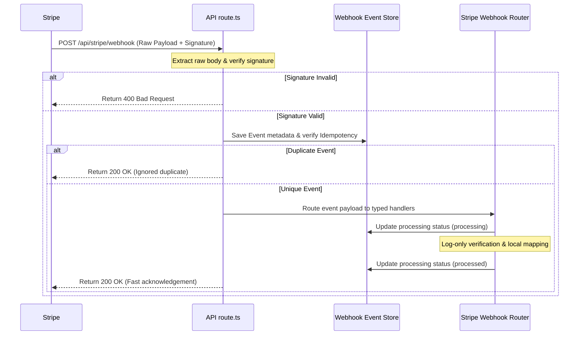

# Technical Plan: DXBMARK Website Baseline & Stripe Payment Readiness

This plan outlines the technical design, routing structure, environment validation, database logging, security controls, and verification gates for establishing the DXBMARK website baseline and Stripe webhook payment readiness.

---

## 1. Technical Context

- **Platform**: Next.js 16.2.9 using App Router, hosted on Vercel.
- **Database**: Managed PostgreSQL (Supabase/Neon) using Drizzle ORM.
- **Queueing/Async**: Upstash QStash (Serverless HTTP-based queue).
- **Observability**: Sentry for real-time error tracking and alerting; Vercel console logs as secondary operational logs.
- **Phase 1 Target**: Log-only verified Stripe webhook receiver and event store (no customer state alteration).
- **First Payment Model**: Zoho Books invoices connected to Stripe.

---

## 2. Constitution Check

- **Brand Consistency**: All client-facing interfaces MUST use brand color `#f97e1a` and the Inter/Utopia typographic stacks.
- **Payment Gateway**: Stripe is the official and only approved payment gateway. Alternate gateways (PayPal, cryptocurrency) are strictly out of scope.
- **Key Security**: All keys MUST remain server-side. No `sk_`, `rk_`, or `whsec_` credentials in version control. Zod schema MUST validate variables on startup.
- **Webhook Source of Truth**: Success page redirects MUST NOT verify payment. Cryptographically signed Stripe webhooks are the sole confirmation.
- **Timeout Compliance**: We acknowledge webhooks quickly (returning 2xx status) and defer slow tasks asynchronously via QStash.

---

## 3. Architecture Overview



---

## 4. Proposed Project Structure

To maintain separation of concerns, the webhook route itself must be thin, delegating validation, logging, and routing to modular helpers inside `src/server/stripe/v1/`.

```text
src/
  app/
    api/
      stripe/
        webhook/
          route.ts                 # Thin endpoint, raw body parsing, signature check
  server/
    env.ts                         # Zod environment schema and validation rules
    stripe/
      v1/
        client.ts                  # Server-only Stripe client initialized with restricted keys
        config.ts                  # Safe configuration constants (tolerances, log levels)
        constants.ts               # Approved event type listings and billing states
        logger.ts                  # Sanitized logging wrapper (redacts card/payload/PII details)
        webhook-router.ts          # Event router dispatching event types to specific handlers
        webhook-security.ts        # Signature validation and raw body buffer helpers
        handlers/
          checkout.ts              # Handles checkout.session.completed, checkout.session.expired
          invoices.ts              # Handles invoice.finalized, invoice.paid, invoice.payment_failed
          subscriptions.ts         # Handles customer.subscription.* updates
          customers.ts             # Handles customer.created, customer.updated
          refunds.ts               # Handles charge.refunded
          disputes.ts              # Handles charge.dispute.created
        store/
          webhook-event-store.ts   # Database repository interface for storing event logs (Drizzle)
          integration-job-store.ts # Database repository interface for managing integration queues
```

---

## 5. Environment Variable Plan

All variables MUST be validated in `src/server/env.ts` at startup.

- `STRIPE_RESTRICTED_KEY`: The restricted API key (rk_*) used for server-side read actions.
- `STRIPE_WEBHOOK_SECRET`: Webhook endpoint secret (whsec_*) used to verify signatures.
- `STRIPE_WEBHOOK_TOLERANCE_SECONDS`: Time tolerance offset (defaults to 300).
- `DATABASE_URL`: Connection string for PostgreSQL database.
- `QSTASH_TOKEN`: Auth token for Upstash QStash REST API client.
- `QSTASH_CURRENT_SIGNING_KEY`: Key to verify incoming jobs forwarded from QStash.
- `QSTASH_NEXT_SIGNING_KEY`: Rollover key for QStash token rotations.
- `WEBHOOK_PROCESSING_MODE`: Set to `log_only` for Phase 1.

---

## 6. Database & Event Store Plan

Using Neon or Supabase PostgreSQL integrated via Drizzle ORM:
- **Event Logging Table**: Keeps track of `stripe_event_id`, `event_type`, `received_at`, and `processing_status`. To ensure idempotency, a UNIQUE constraint is placed on `stripe_event_id`.
- **Billing States Table**: Keeps track of active subscription states mapped from Stripe events.
- **Integration Jobs Table**: Tracks background tasks dispatched to QStash to sync with external partners (e.g. Zoho Books).

---

## 7. Security Controls & Validation Gates

1. **Raw Body Extraction**: Signature validation MUST be done on the raw request body. Never parse JSON before verification.
2. **Key Protection**: Secrets are stored only in server env vars and never logged or exposed.
3. **Least Privilege**: Stripe operations MUST use a Restricted API Key (rk_*) containing only the permissions required for Phase 1 operations.
4. **Idempotency**: Unique constraint checks on `stripe_event_id` in the database to prevent duplicate processing.
5. **PII Sanitization**: Logger and Sentry filters redact card numbers, billing addresses, secrets, and raw payload data.
6. **Validation Gates**: Pre-deployment validation requires passing typescript checks, lint rules, production build validation, webhook unit tests, and secret scans.

---

## 8. Required ADRs Before Implementation

- **ADR 01: Payment Event Store Database Provider**
- **ADR 02: Background Job and Retry Processing Provider**
- **ADR 03: Stripe API Key Strategy**
- **ADR 04: Observability and Logging Strategy**

