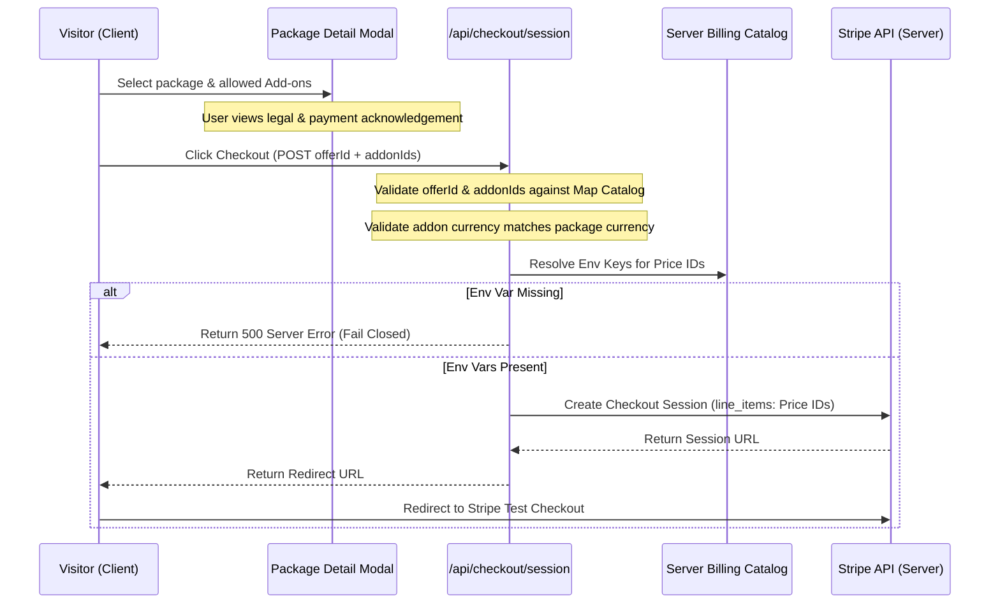

# Technical Plan: Digital Service Packages + Secure Test Checkout

This plan outlines the architecture, data models, environment variables, security rules, and verification gates for the Digital Service Packages and Secure Test Checkout.

---

## 1. Technical Context

- **Platform**: Next.js 16.2.9 (App Router) on Vercel.
- **Database**: Managed PostgreSQL (Supabase/Neon) using Drizzle ORM.
- **Payment Gateway**: Stripe (Test Mode only).
- **Fulfillment**: Decoupled (log-only webhook logs, no automatic emails, no Zoho sync).
- **Price Resolution**: Stripe Checkout using server-resolved Price IDs from environment variables.
- **Lint Standards**: No `eslint-disable` comments. Safe `Map` collections and static `switch` resolvers are used for lookup operations.

---

## 2. Constitution Check

- **Brand Consistency**: All client-facing interfaces MUST use the approved Inter/Utopia typographic stack and color theme from DESIGN.md.
- **Pricing Authority**: Client-facing price text is only a display label. Stripe/server-side catalog is the source of truth for checkout line items. The client does not calculate totals or submit prices.
- **Stripe Price Resolution**: Price IDs are resolved dynamically from environment variables. If a required Price ID environment variable is missing, the server fails closed with a controlled server error.
- **Stripe Mode & Config**: Use explicit server-side test-mode configuration and trusted Stripe Price IDs resolved from environment variables. Never accept mode, amount, currency, or Price IDs from the client.
- **No Env Modification in Phase 1**: Phase 1 must not modify `.env`, `.env.local`, or Vercel environment settings. It may only document required env variable names in `quickstart.md`.
- **Decoupled Fulfillment**: No Zoho sync, CRM updates, or SMTP emails are triggered on webhook checkout completion.

---

## 3. Architecture Overview

### Selection to Checkout Flow



---

## 4. Proposed Project Structure

```text
src/
  features/
    pricing/
      components/
        DigitalServicePackagesSection.tsx  # Landing page package grid
        ServicePackageCard.tsx             # Scannable package tier card
        PackageDetailModal.tsx             # Details modal + legal acknowledgement
        PackageAddonsSelector.tsx          # Allowed add-on selection checklist
      data/
        package-copy.ts                    # UI copy for exclusions and scope
      types.ts                             # Pricing feature specific types
  server/
    billing/
      types.ts                             # Server catalog and payment type definitions
      package-catalog.ts                   # Truth layer mapping offerId/addonId to Price Env Keys
      checkout-validation.ts               # Payload validation logic (checks mismatching addons & currency)
  app/
    api/
      checkout/
        session/
          route.ts                         # Session creation endpoint (Phase 3)
```

---

## 5. Catalog Schema & Types

### Server Catalog Schema
Defined in `src/server/billing/types.ts`:
- **`Package`**: `id`, `name`, `description`, `displayPriceLabel`, `displayBillingLabel?`, `currencyGroup`, `stripePriceEnvKey`, `allowedAddons`, `scope`, `exclusions`
- **`Addon`**: `id`, `name`, `displayPriceLabelUsd?`, `displayPriceLabelAed?`, `displayBillingLabel?`, `currencyGroup`, `stripePriceEnvKeyUsd?`, `stripePriceEnvKeyAed?`

### Verification Boundaries
- Client submits only `offerId` (string) and `addonIds` (string[]).
- Server rejects any unknown IDs.
- Server rejects any `addonId` that is not allowed for the package or does not match the package currency.

---

## 6. Security Controls & Validation Gates

1. **Client Isolation**: Client components have zero access to Stripe secrets, database client directly, or pricing catalog internals.
2. **Server-Side Validation**: Mismatching, duplicate, or empty add-on payloads are rejected.
3. **No Dynamic Object Indexing Warnings**: Lookups utilize `Map.get` and environment resolution uses a static `switch` statement, ensuring no lint errors.
4. **Stripe Test Mode**: Use explicit server-side test-mode configuration and trusted Stripe Price IDs resolved from environment variables. Never accept mode, amount, currency, or Price IDs from the client.
